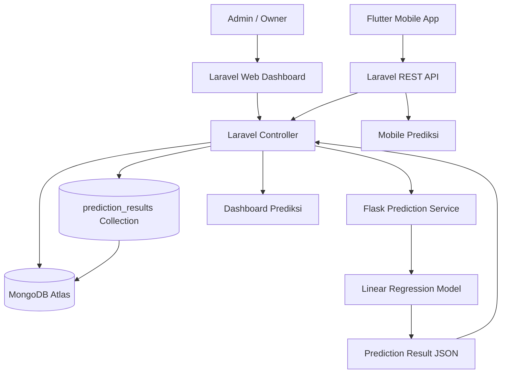

# Sistem Prediksi Penjualan Bunga

## Deskripsi

Proyek ini adalah sistem prediksi penjualan bunga menggunakan **Laravel** sebagai web dashboard dan REST API, **MongoDB Atlas** sebagai database online, serta **model Linear Regression berbasis Flask yang sudah online** untuk menjalankan proses Machine Learning.

Model yang digunakan adalah **Linear Regression** untuk memprediksi jumlah penjualan berdasarkan data historis transaksi.

---

## Overall Architecture

Arsitektur sistem terdiri dari Laravel Web Dashboard, REST API untuk aplikasi mobile, MongoDB Atlas sebagai database cloud, dan model prediksi berbasis Flask online sebagai service prediksi. Laravel membaca data transaksi dari MongoDB Atlas, mengirim fitur prediksi ke service Flask, lalu menyimpan hasil prediksi kembali ke MongoDB Atlas agar dapat ditampilkan di dashboard dan aplikasi mobile.



Alur sistem:

1. Data stok, user, transaksi, dan penjualan tersimpan di **MongoDB Atlas**.
2. **Laravel Web Dashboard** digunakan admin/owner untuk mengelola data dan melihat hasil prediksi.
3. **Laravel REST API** digunakan aplikasi mobile untuk login, stok, transaksi, dashboard, notifikasi, dan prediksi.
4. Saat generate prediksi, **Laravel Controller** mengambil data historis dari MongoDB Atlas.
5. Laravel mengirim fitur prediksi ke **service Flask online yang menjalankan model Linear Regression**.
6. Flask menjalankan model **Linear Regression** dan mengembalikan hasil dalam format **JSON**.
7. Laravel menyimpan hasil prediksi ke MongoDB Atlas dan menampilkannya pada dashboard serta endpoint mobile.

---

## Teknologi yang Digunakan

- Laravel (Web Dashboard dan REST API)
- MongoDB Atlas
- Model Linear Regression berbasis Flask Online
- Python
- Scikit-learn
- Blade Template

---

## Dataset

Dataset berasal dari **MongoDB Atlas** dengan collection utama:

```text
penjualans
products
prediction_results
```

Dataset transaksi berisi sekitar **91.300 transaksi penjualan bunga**.

Dataset tidak disimpan di repository karena ukurannya besar dan diambil langsung dari MongoDB Atlas saat proses prediksi dijalankan.

---

## Struktur Proyek

```text
prediksi-penjualan-bunga
|-- app
|-- database
|-- resources
|-- routes
|-- machine_learning
|   |-- prediction.py
|   `-- clean_dataset.py
|-- README.md
`-- LICENSE
```

---

## Output Model

Model menghasilkan:

- Prediksi total penjualan
- MAE (Mean Absolute Error)
- RMSE (Root Mean Squared Error)

Hasil prediksi disimpan di MongoDB Atlas dan ditampilkan pada dashboard Laravel serta endpoint prediksi untuk aplikasi mobile.

---

## Lisensi

Proyek ini menggunakan **MIT License**. Detail lisensi tersedia pada file [LICENSE](LICENSE).
